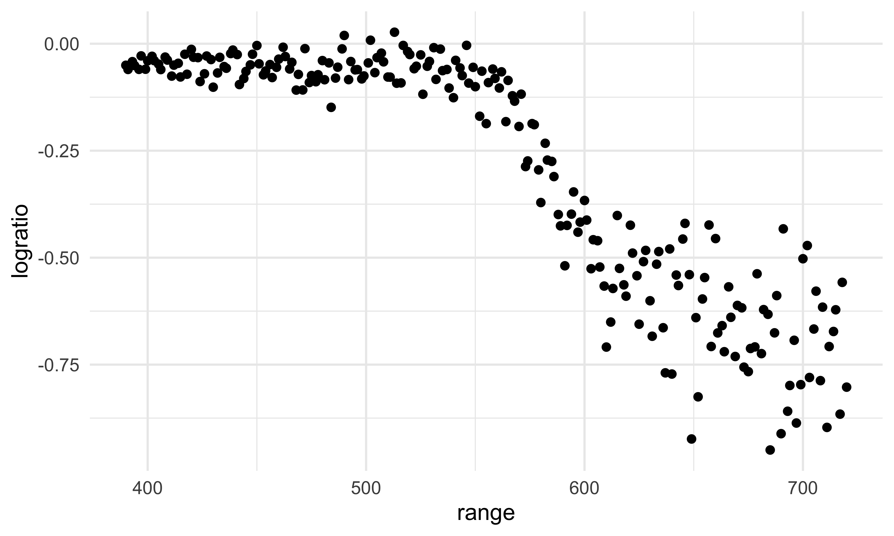
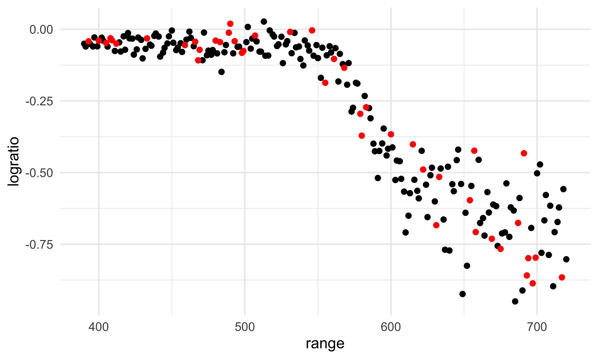
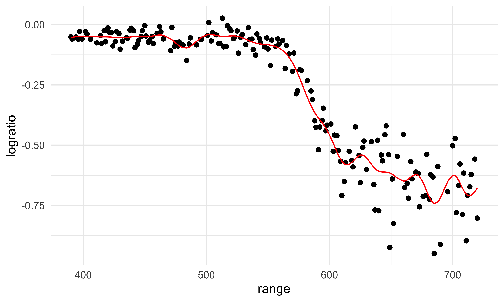
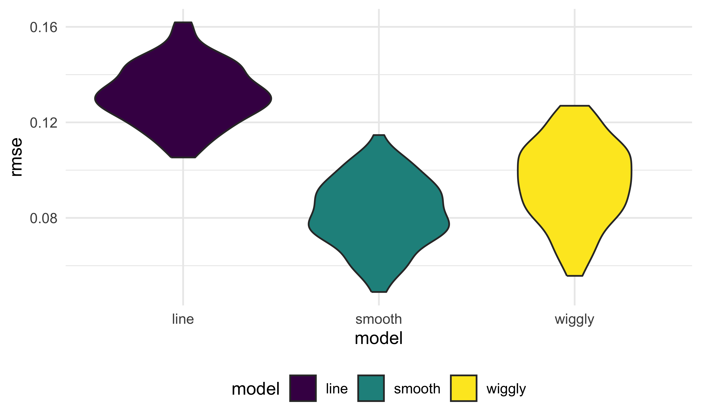
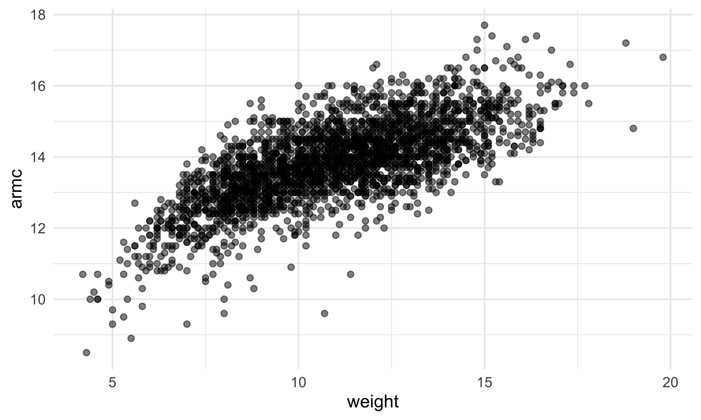
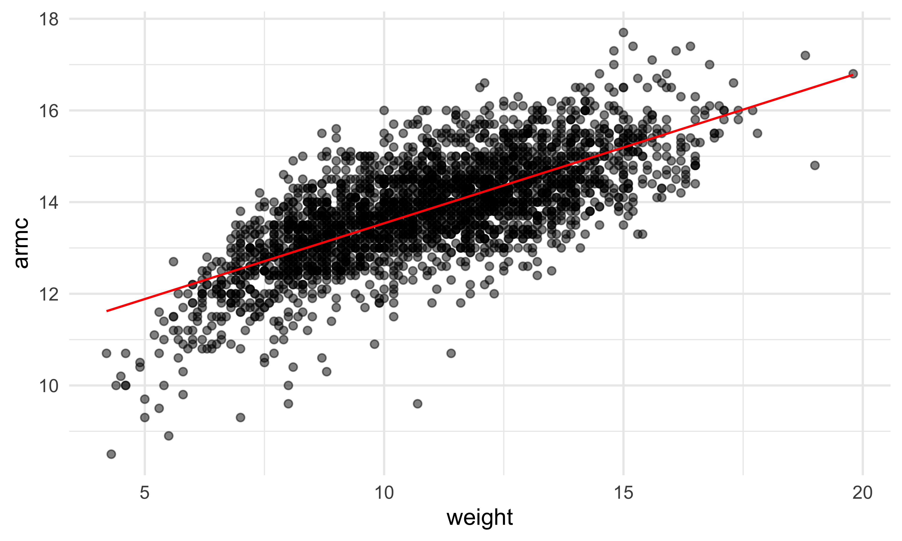
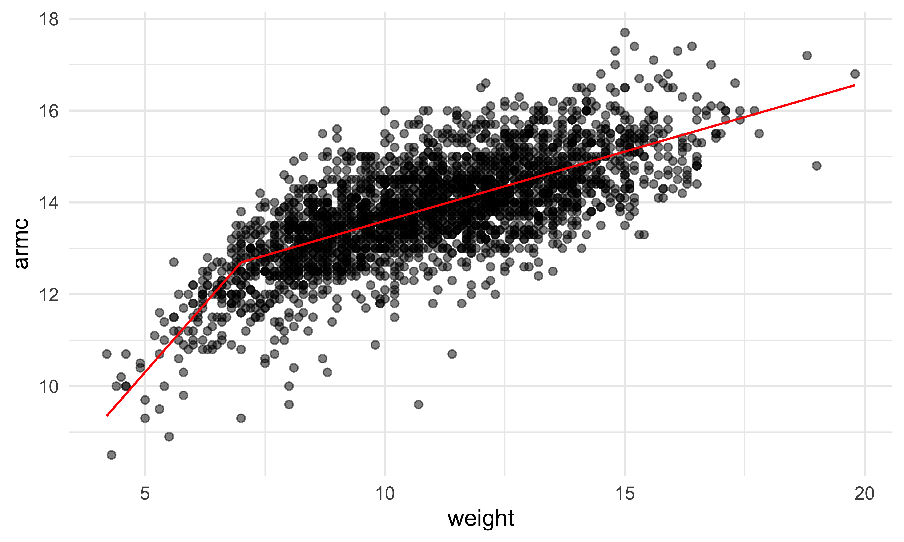
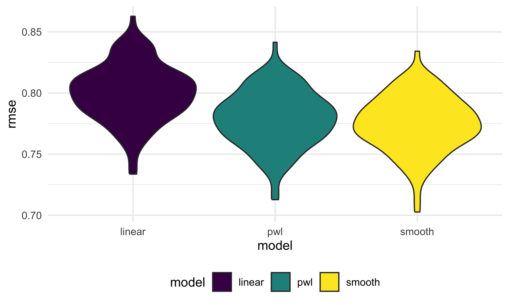

cross_validation
================
Bohan Zhu
2025-11-11

``` r
library(tidyverse)
library(p8105.datasets)
library(modelr)

data("lidar")
```

Look at the data

``` r
lidar_df =
  lidar |> 
  mutate(id = row_number())

lidar_df |> 
  ggplot(aes(x = range, y = logratio)) +
  geom_point()
```



## Create dataframes

``` r
train_df = 
  sample_frac(lidar_df, size = .8) |> 
  arrange(id)

test_df = anti_join(lidar_df, train_df, by = "id")
```

Look at these

``` r
ggplot(train_df, aes(x = range, y = logratio)) +
  geom_point()+
  geom_point(data = test_df, color = "red")
```



Fit a few models to `train_df`

``` r
linear_mod = lm(logratio ~ range, data = train_df)

smooth_mod = mgcv::gam(logratio ~ s(range), data = train_df)

wiggly_mod = mgcv::gam(logratio ~ s(range, k = 30),  sp = 10e-6, data = train_df)
```

Look at this

``` r
train_df |> 
  add_predictions(wiggly_mod) |> 
  ggplot(aes(x = range, y =logratio)) +
  geom_point() +
  geom_line(aes(y = pred), color = "red")
```



Try computing our RMSEs

``` r
rmse(linear_mod, test_df)
```

    ## [1] 0.1418617

``` r
rmse(smooth_mod, test_df)
```

    ## [1] 0.09366103

``` r
rmse(wiggly_mod, test_df)
```

    ## [1] 0.1080971

## ITERATE!!

``` r
cv_df = 
  crossv_mc(lidar_df, n = 100) |> 
  mutate(
    train = map(train, as_tibble),
    test = map(test, as_tibble)
  )
```

Did this work?

``` r
cv_df |> 
  pull(train) |> nth(3)
```

    ## # A tibble: 176 × 3
    ##    range logratio    id
    ##    <dbl>    <dbl> <int>
    ##  1   390  -0.0504     1
    ##  2   391  -0.0601     2
    ##  3   394  -0.0510     4
    ##  4   396  -0.0599     5
    ##  5   397  -0.0284     6
    ##  6   399  -0.0596     7
    ##  7   400  -0.0399     8
    ##  8   402  -0.0294     9
    ##  9   403  -0.0395    10
    ## 10   406  -0.0604    12
    ## # ℹ 166 more rows

Let’s fit models over and over

``` r
lidar_lm = function(df){
  lm(logratio ~range, data = df)
}
```

``` r
cv_df =
  cv_df |> 
  mutate(
    linear_fits = map(train, \(df) lm(logratio ~ range, data = df)),
    smooth_fits = map(train, \(df) mgcv::gam(logratio ~ s(range), data = df)),
    wiggly_fits = map(train, \(df)mgcv::gam(logratio ~ s(range, k =50), 
                                            sp = 10e-8, data = df))
  ) |> 
  mutate(
    rmse_line = map2_dbl(linear_fits, test, rmse),
    rmse_smooth = map2_dbl(smooth_fits, test, rmse),
    rmse_wiggly = map2_dbl(wiggly_fits, test, rmse)
  )
```

Let’s try to look at this better

``` r
cv_df |> 
  select(starts_with("rmse")) |> 
  pivot_longer(
    everything(),
    names_to = "model",
    values_to = "rmse",
    names_prefix = "rmse_"
  ) |> 
  ggplot(aes(x = model, y = rmse,fill = model)) +
  geom_violin()
```



## child growth

``` r
growth_df =
  read_csv("nepalese_children.csv")
```

    ## Rows: 2705 Columns: 5
    ## ── Column specification ────────────────────────────────────────────────────────
    ## Delimiter: ","
    ## dbl (5): age, sex, weight, height, armc
    ## 
    ## ℹ Use `spec()` to retrieve the full column specification for this data.
    ## ℹ Specify the column types or set `show_col_types = FALSE` to quiet this message.

Weight v arm_c

``` r
growth_df |> 
  ggplot(aes(x = weight, y = armc)) +
  geom_point(alpha = .5)
```



Let’s show the models we might use.

``` r
growth_df = 
  growth_df |> 
  mutate(
    weight_cp7 = (weight > 7) * (weight -7)
  )
```

Let’s fit three models

``` r
linear_mod = lm(armc ~ weight, growth_df)

pwl_mod    = lm(armc ~ weight + weight_cp7, growth_df)

smooth_mod = mgcv::gam(armc ~ s(weight), data = growth_df)
```

``` r
growth_df |> 
  add_predictions(linear_mod) |> 
  ggplot(aes(x = weight, y = armc)) +
  geom_point(alpha = 0.5) +
  geom_line(aes(y = pred), color = "red")
```



``` r
growth_df |> 
  add_predictions(pwl_mod) |> 
  ggplot(aes(x = weight, y = armc)) +
  geom_point(alpha = 0.5) +
  geom_line(aes(y = pred), color = "red")
```



``` r
growth_df |> 
  add_predictions(smooth_mod) |> 
  ggplot(aes(x = weight, y = armc)) +
  geom_point(alpha = 0.5) +
  geom_line(aes(y = pred), color = "red")
```


Now cross validate

``` r
cv_df = 
  crossv_mc(growth_df, n = 100) |> 
  mutate(
    train = map(train, as_tibble),
    test = map(test, as_tibble)
  )
```

``` r
cv_df = 
  cv_df |> 
  mutate(
    linear_mod = map(train, \(df) lm(armc ~ weight, data = df)),
    pwl_mod =  map(train, \(df) lm(armc ~ weight + weight_cp7, data = df)),
    smooth_mod = map(train, \(df) mgcv::gam(armc ~ s(weight), data = df))
  ) |> 
  mutate(
    rmse_linear = map2_dbl(linear_mod, test, rmse),
    rmse_pwl = map2_dbl(pwl_mod, test, rmse),
    rmse_smooth = map2_dbl(smooth_mod, test, rmse),
  )
```

create my boxplots

``` r
cv_df |> 
  select(starts_with("rmse")) |> 
  pivot_longer(
    everything(),
    names_to = "model",
    values_to = "rmse",
    names_prefix = "rmse_"
  ) |> 
  ggplot(aes(x = model, y = rmse,fill = model)) +
  geom_violin()
```


